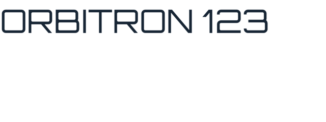

# Apple downloadable-font evidence

Both images render the same generated Remote Compose document through the pure-Swift UIKit player
at density 1. The first disables downloadable-font resolution and verifies the required system-font
fallback. The second opts into `RemoteComposeGoogleFontsResolver` and shows the downloaded Orbitron
face registered through CoreText.

| resolver omitted (fallback) | Google Fonts resolver enabled |
| --- | --- |
|  |  |

Regenerate with `scripts/check-apple-google-font-rendering.sh`. The script constructs both inputs
from `scripts/apple-google-fonts/GenerateFixture.swift`; their `.rc` bytes are identical.
