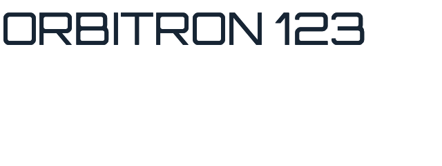

# macOS desktop downloadable-font evidence

Both images render the same generated Remote Compose document through the release desktop app's
pure-Swift AppKit renderer at density 1. The first uses the required system-font fallback. The
second uses the app's default `RemoteComposeGoogleFontsResolver` path and registers the downloaded
Orbitron face with CoreText before AppKit creates its `NSTextField`.

| resolver disabled (fallback) | release-app default (Google Fonts) |
| --- | --- |
|  |  |

Regenerate with `scripts/check-macos-google-font-rendering.sh renders/macos-google-fonts`. The
script constructs one input from `scripts/apple-google-fonts/GenerateFixture.swift`; both images
therefore consume identical `.rc` bytes.
