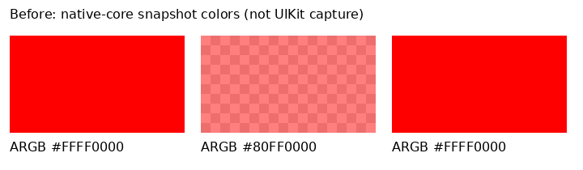
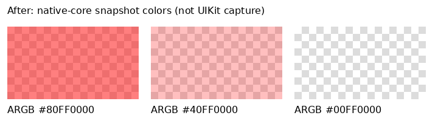

# Native color-filter evidence

The PNGs rasterize actual native-core snapshot colors over a checkerboard. They are **not UIKit
screenshots**: UIKit and Core Graphics require a Mac. `before.json` and `after.json` record the
colors returned by the same encoded rectangles before and after the fix.

The three rectangles use, from left to right:

| Destination alpha | Filter alpha | Before ARGB | After ARGB |
| --- | --- | --- | --- |
| 128/255 | 255/255 | `FFFF0000` | `80FF0000` |
| 128/255 | 128/255 | `80FF0000` | `40FF0000` |
| 0/255 | 255/255 | `FFFF0000` | `00FF0000` |




Reproduce from the repository root with Swift 6 and Python Pillow:

```sh
scripts/native-color-filter-evidence/render.sh ac86ed5b06d82a22d87a6320dc90de11e77d2646
```

The script extracts the base sources without changing the working tree, resolves each version's
colors through `NativeSwiftDocumentSession`, and rasterizes those colors. The core tests check
both alpha factors, independent paint alpha, live color IDs, unsupported filter diagnostics and
filter clearing. The repository's Apple CI also runs the native package and simulator tests.
