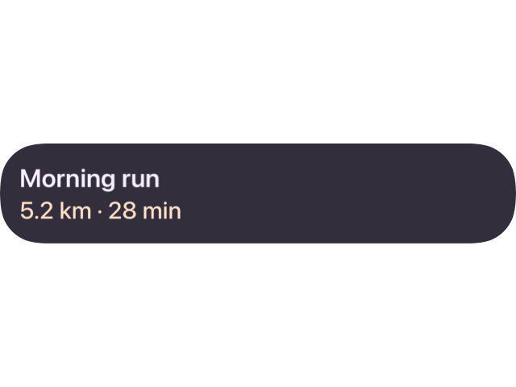
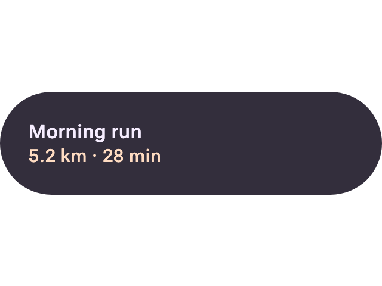
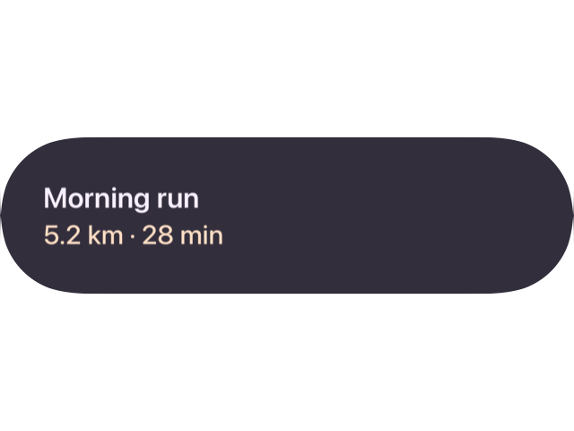

# Native Swift rendering correctness

These captures compare the pure-Swift UIKit renderer with the CMP JVM reference over the same
Remote Compose documents. The change is evaluated primarily for visual correctness: content,
wrapping, layout hierarchy, padding, alignment, clipping, and component shape. Small differences in
native font shaping and antialiasing are expected.

## Morning Run title card

| Before | CMP reference | After |
| --- | --- | --- |
|  |  |  |

The native renderer now honors the document's DP density behavior and clamps an oversized rounded
corner to half the resolved component height. The title card retains its bottom padding instead of
being clipped by the stale pre-layout path.

## Image button

| Before | CMP reference | After |
| --- | --- | --- |
|  |  |  |

The exact button width is now propagated before TextKit measures the label. `Primary label` occupies
two lines, and the component-sized texture fills the final 172 × 96 component bounds.

The accompanying [`comparison.json`](comparison.json) records 1.10% differing pixels for the title
card and 0.04% for the image button after the fixes. Those residuals are attributable to native text
and edge rasterization; the intended content and geometry are preserved.
