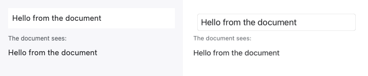

# Native UIKit custom-component evidence

The same generated `editable-text.rc` document is rendered by the CMP custom-component registry
and the native UIKit registry. The left lane is CMP/JVM; the right lane is the iOS simulator using
a hosted SwiftUI `TextField` inside the native `UIView` component tree.



The first pure-Swift runtime slice executes this document without crossing into Kotlin. The image
below is captured from that path; the previous Kotlin-backed native capture is retained above as
the before evidence.


The native lane intentionally retains the UIKit/Core Text metric and default-control differences
already documented by the experimental compatibility profile. The Swift-core comparison reports
96.29% exact pixel agreement; the acceptance criterion here is the same component structure,
resolved document text/color, and an actual editable Apple control rather than pixel parity.

Regenerate with:

```shell
scripts/check-native-uikit-custom-components.sh
```
