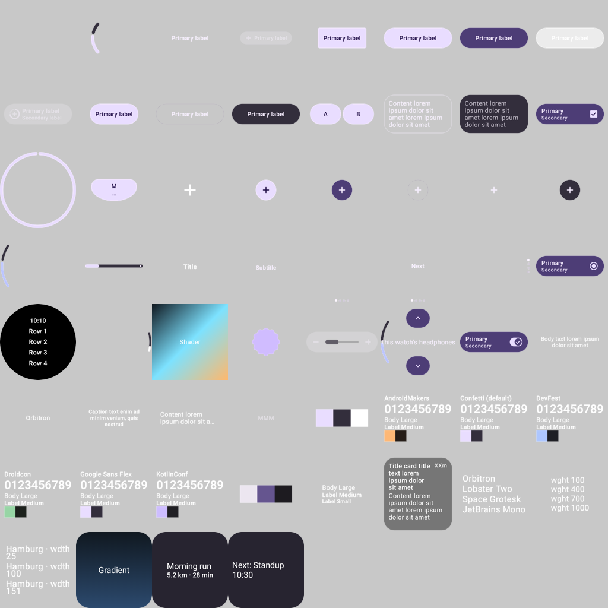

# rc-android-catalog — the CMP player drawing the remote-m3 catalog on Android

One document of every remote-m3 component family from the committed corpus
(`scripts/rc-catalog-corpus/corpus`), rendered by `RcComposePlayer` on **Android** — through
`android.graphics`, not Skiko — under Robolectric's native graphics mode (API 34), 384 px at
density 2, downscaled into one sheet.



This is `RcAndroidRenderTest.rendersOneDocumentOfEveryCatalogComponent`. The test asserts every
document renders without an exception and fewer than a tenth come out as one flat colour; with
`-Prc.android.out=<abs dir>` it also writes each render as a PNG:

```
./gradlew :rc-player-compose:testAndroidHostTest --rerun -Prc.android.out=<abs dir>
```

Text in a host-supplied family (Orbitron, Lobster Two, …) falls back to the default face here: the
test passes no typeface loader, which is a harness choice rather than a player gap.
