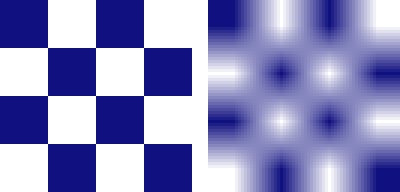

# rc-bitmap-filter — `FILTER_BITMAP` reaching the CMP player's bitmap draws

Before/after for the bitmap-filter port in #470. A 4×4 checkerboard (`BitmapData`, RAW8888) is
drawn twice, stretched to 192 px: on the left under a paint with `FILTER_BITMAP` **off**, on the
right with it **on**.

| before (`3d6bfa8^`) | after |
| --- | --- |
|  |  |

Before, the player ignored paint commands 10 (`IMAGE_FILTER_QUALITY`) and 17 (`FILTER_BITMAP`),
so every scaled bitmap was bilinear-filtered and the two halves are identical. After, the left half
samples without blending (hard cell edges, as AndroidX draws it) and the right half is unchanged.

Regenerate with:

```
./gradlew :rc-player-compose:jvmTest --rerun --tests '*RcBitmapFilterEvidenceTest*' \
  -Prc.bitmapFilter.out=<abs dir>
```

and copy `filter-bitmap.png` to `after-filter-bitmap.png` (the `before` image comes from the same
test run on `3d6bfa8^`, the commit before #470).
