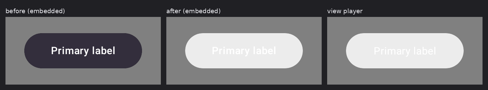

# A bitmap declared in a component's canvas stream

Before/after for the delta in [#54](https://github.com/yschimke/rc-players/issues/54), an
image-background button whose container painted a flat scrim where the View and CMP players both
drew the image.

| Document | before | after |
| --- | --- | --- |
| `ImageBackgroundRemoteButton` base | 34.27% differ from the view lane | **0 differing pixels** |
| `…_VARIANT_disabled` | 35.25% | **0** |
| `…_VARIANT_secondary-label` | 33.71% | **0** |
| `…_VARIANT_secondary-label` (2) | 32.42% | **0** |

Container colour on the centre row: `(51, 46, 60)` before, `(236, 236, 236)` after — the View and
CMP lanes both drew `(236, 236, 236)` throughout, **with zero differing pixels between them**, which
is what identified the embedded lane as the outlier rather than the reference.

## One miss, two casualties

Setup registers each `BitmapData`'s metadata without decoding it, and `findBitmaps` followed
`Container.getList()` only. A component's draw-content operations hang off it as a *field* rather
than as a child, so a bitmap declared in a canvas stream was never registered — the same structural
gap as [#50](https://github.com/yschimke/rc-players/issues/50), and one function above
`findComponentValues`, which has always had the branch.

`remote-m3` declares this button's bitmap exactly there, and `getObject(imageId)` returning null cost
both things that read it:

* the **texture** — `resolveBitmap` gives up when the object is not a `BitmapData`; and
* the image's **width and height** — `ImageAttribute.paint` reads the same object to publish them.

The container is a texture with a scrim gradient over it whose geometry derives from those
dimensions. Unresolved, the gradient degenerated to its first stop, `0xFF332E3C`, and painted the
container flat in it. Its second stop is `0x00332E3C` — the same colour at alpha 0 — so the scrim
should have faded off the image entirely by the centre of the button.

## Why `ImageAttribute` also needs an explicit draw case

Registration alone is not enough. `ImageAttribute` is a `PaintOperation` that publishes from
`paint`, like `ColorAttribute` — but `ColorAttribute` implements `VariableSupport` and
`VariableProvider`, so `buildComputedOpIndex` picks it up, while `ImageAttribute` implements
**neither** and can never be indexed however hard that walk looks. It gets the same
`GraphPaintContext` branch `ColorAttribute` already had.

Both halves are load-bearing: `RcCanvasStreamBitmapRenderTest` was verified to fail with either one
reverted. It asserts an exact colour rather than ink, because the defect drew a full container of
the wrong colour and every ink-based measure passes on it.

## Regression sweep

All 478 `remote-m3` documents, embedded lane scored against the view lane before and after: **9
improved, 0 regressed.** Beyond the four cells above, three `TitleCard` background-image and gallery
cells went 65.52% → 4.84%, 65.51% → 11.08% and 47.60% → 3.88%. The three `CircularProgressRemote`
`indeterminate` cells that move in both directions across unrelated runs are animation sampling, not
a change in behaviour — two of the five improved in the same sweep.
