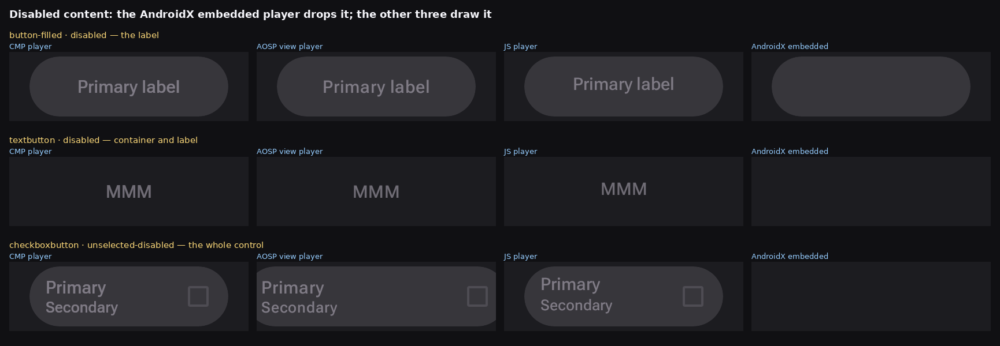
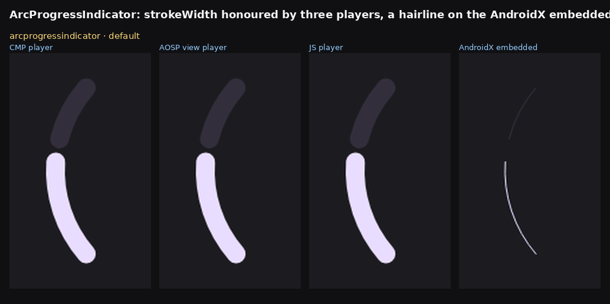
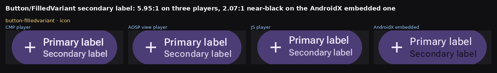
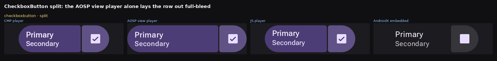
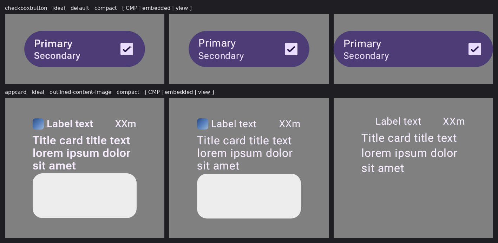
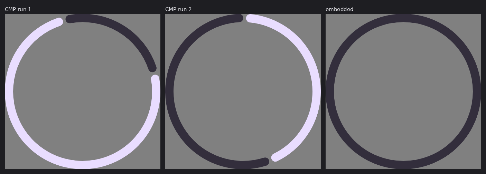

# CMP player vs the AndroidX lanes — every published `remote-m3` document

The counterpart of [`../rc-embedded-lane-ab/`](../rc-embedded-lane-ab), one player over. That sweep
asks whether the **embedded** player agrees with the View player on the Home Assistant catalog;
this one asks whether **this repository's CMP player** agrees with anybody, across all 478
documents the `remote-m3` catalog publishes.

It exists because the question was being answered the other way round. Fourteen open reports on
[yschimke/wear-m3-catalog](https://github.com/yschimke/wear-m3-catalog/issues) name a defect in the
`remote-m3` sheet, most of them as an upstream `remote-material3` bug, and all of them rest on a
**baked** capture. A baked capture is one player's opinion: `RemoteOverridablePreview` defaults to
`EMBEDDED`, so every one of those reports is the AndroidX embedded player's render and nothing
else.

## Method

One document, four interpreters, no other variable. The `.rc` bytes come from the published
catalog (`GET /remote-m3/render/<id>.rc`), so the document is fixed and only the player changes:

| Lane | What runs |
| --- | --- |
| **CMP** | `RcComposePlayer`, rendered here by [`RcCmpRenderHarness`](../../rc-player/compose/src/jvmTest/kotlin/ee/schimke/composeai/rcplayer/compose/RcCmpRenderHarness.kt) |
| **AOSP view** | `remote-player-view`'s `RemoteComposePlayer`, served live by the preview host as `?rcPlayer=java` |
| **JS** | the vendored TypeScript player |
| **AndroidX embedded** | `RcPlayer` — the lane every baked capture goes through |

Scored two ways, because one of them lies. Raw `pixelmatch` at 2% buries a real defect under text
rasterization, so the structural pass first box-downsamples 8× (and 16× as a check), which keeps
geometry, colour and presence while dropping glyph edges.

```
./gradlew :rc-player-compose:jvmTest --rerun --tests '*RcCmpRenderHarness*' \
  -Prc.cmp.input=<staged dir> -Prc.cmp.output=<out dir>
```

**Stage the fonts, or the sweep measures the wrong thing.** A `CoreText` naming no family asks the
host for its `default` face, and with no manifest loaded it silently gets Compose's built-in one —
which draws perfectly good text a few percent wider, in every document containing a glyph. The
first run of this sweep read as 86 documents where all four players disagreed; loading the repo's
vendored `fonts.json` collapsed that to text-metric noise. The harness therefore loads
`rc-player/wasm/dist-assets/fonts` by default and fails rather than falling back.

[`RcManifestTypefaceRenderTest`](../../rc-player/compose/src/jvmTest/kotlin/ee/schimke/composeai/rcplayer/compose/RcManifestTypefaceRenderTest.kt)
was written to catch exactly that and could not: **an `assumeTrue` on a path that no longer resolves
is a test that reports green without running.** Thirteen tests across four files and three players
were in that state, all guarding on a font directory that stopped existing when the player was
extracted into this repository.

So the font tests point at the vendored faces and **assert** rather than assume. The faces are in
this repository, so their absence is a broken checkout rather than an environment to skip in — which
is the property that stops this rotting a second time.

## Result

The question this sweep was built to answer, stated as a count: **for how many documents is one
lane the sole outlier while the other three agree with each other?**

| Sole outlier | pixelmatch 2% | 8× / 2% | 16× / 3% |
| --- | ---: | ---: | ---: |
| **CMP player** | **0** | **0** | **0** |
| AOSP view player | 7 | 1 | 4 |
| AndroidX embedded | 0 | 13 | 18 |
| JS player | 0 | 21 | 24 |

466 documents scored on all four lanes; 475 of 475 staged documents rendered on the CMP lane with
no errors. The player's own `composeSupportReport()` finds one capability gap in the whole catalog
— `theme-specimen-droidcon` names `google:Inter`, which the vendored manifest does not carry. That
is a host asset gap, not a player one.

So there is no CMP rendering defect in this corpus to fix. The divergences that *are* here belong
to the other lanes, and three of them are what the wear-m3-catalog reports actually caught.

### The AndroidX embedded player drops disabled content

All 29 documents where the embedded player is the sole structural outlier carry `disabled` in their
name. It draws the container and loses the label; the view player, the JS player and this one all
draw both.



That is [wear-m3-catalog#91](https://github.com/yschimke/wear-m3-catalog/issues/91),
[#130](https://github.com/yschimke/wear-m3-catalog/issues/130) and
[#288](https://github.com/yschimke/wear-m3-catalog/issues/288) — all three filed as upstream
`remote-material3` defects, none of them reproducible outside the embedded lane.

### The AndroidX embedded player ignores `strokeWidth`



[wear-m3-catalog#289](https://github.com/yschimke/wear-m3-catalog/issues/289): 2734 ink pixels on
the view, JS and CMP lanes; 247 on the embedded one.

### The AndroidX embedded player resolves the secondary content colour to near-black



[wear-m3-catalog#326](https://github.com/yschimke/wear-m3-catalog/issues/326) measures 2.07:1 and
contrasts it with Wear's 5.95:1. The view, JS and CMP lanes all resolve `(212, 202, 227)` — 5.95:1,
the number the report calls correct. Only the embedded lane draws `(15, 12, 23)`.

This is the same shape as [#1](https://github.com/yschimke/rc-players/issues/1) and
[#2](https://github.com/yschimke/rc-players/issues/2), both closed: a colour that resolves in one
player and not the other, and a document that looks blank in exactly one lane.

### The AOSP view player lays the split row out full-bleed

Not every outlier is the embedded player's. On `CheckboxButton`'s split cells the view player
stretches the row to the full 454 px canvas where the CMP and JS players stop at 344 px and the
embedded one at 315 px — four players, three answers.



## What this does not claim

Text rasterization is not scored, and is not a defect: pixel identity across font stacks is an
explicit non-goal of the CMP player (`docs/design/RC_CMP_WASM_PLAYER.md`). The residual
CMP-vs-view differences after the font manifest is loaded are a few pixels of glyph advance.

`circularprogressindicator__ideal__indeterminate__*` differs between the local CMP render and the
published Wasm one because it is animated and the two captures are at different phases. It is
listed here so the next reader does not chase it.

## Closing the sweep: what the CMP player looks like once the embedded one is fixed

Re-measured over all 475 staged documents after the four embedded-player defects this sweep found
were fixed ([#48](https://github.com/yschimke/rc-players/pull/48),
[#51](https://github.com/yschimke/rc-players/pull/51),
[#53](https://github.com/yschimke/rc-players/pull/53),
[#56](https://github.com/yschimke/rc-players/pull/56)). This is the section to read first if you
are asking "does the CMP player still get anything wrong" — the answer is measured rather than
asserted, and the method matters as much as the number.

### The View lane is not a usable reference here, and the raw score says so

Scored against the View lane, the CMP player differs on **61 documents by more than 5%**, which
reads alarming until you look at three lanes instead of two. On every one of the worst cases the
**View** lane is the odd one out, 2-to-1:



* `checkboxbutton` — CMP and embedded draw the same inset pill at the same corner radius; the View
  lane draws it wider, running past the frame.
* `appcard__ideal__outlined-content-image` — CMP and embedded both draw the app icon and the
  content image; the View lane draws **neither**, because its harness has no encoded-image support.

So a CMP-vs-View score is measuring the View harness's limits, not the CMP player's correctness.
That is worth stating plainly because this whole sweep exists to stop exactly that mistake being
made one layer down — a lane disagreeing is never, by itself, evidence about *which* lane is wrong.

### Against the fixed embedded lane

| | documents |
| --- | ---: |
| byte-identical | **258** |
| under 1% | 98 |
| 1–5% (Skia-vs-Android glyph rasterisation) | 114 |
| over 5% | **5** |
| **reproducible difference over 5%** | **0** |

The seven `titlecard`/`button-imagebackground` documents that scored 32–65% before #56 land at
~2% after it — they were the embedded lane's bug, not this one's.

### The five that remain are nondeterministic, and that is proven rather than assumed

Rendering the CMP lane **against itself** at one commit, no code change between the two runs:

```
documents: 475   identical: 470   <1%: 0   1-5%: 0   >5%: 5
```

The five that differ are exactly the five `circularprogressindicator__ideal__indeterminate__*`
documents, at the same magnitudes (11.16% self-vs-self against 11.36% cross-lane). A lane that does
not agree with *itself* on a document cannot be said to disagree with another lane on it.



These are animated documents and the two runs sample the animation at different phases. Comparing
them across lanes is meaningless until the harness pins a frame time; until then they belong on the
unscorable list rather than in a diff. `../../.claude/skills/flake-triage/SKILL.md` is the general
form of this oracle.

### The conclusion

**No document in this catalog shows a reproducible CMP rendering defect.** The two the sweep did
find were fixed with tests: letter spacing read as pixels where the wire format specifies ems
([#51](https://github.com/yschimke/rc-players/pull/51)), and the `google:Inter` faces the
manifest-only Wasm/CMP lane could not draw at all
([#58](https://github.com/yschimke/rc-players/pull/58)).

That is a real result rather than an absence of one: the sweep started from fourteen reports filed
against `remote-material3`, and it ends with the CMP player exonerated by measurement, five
documents correctly reclassified as unscorable, and the defects relocated to where they actually
were.
