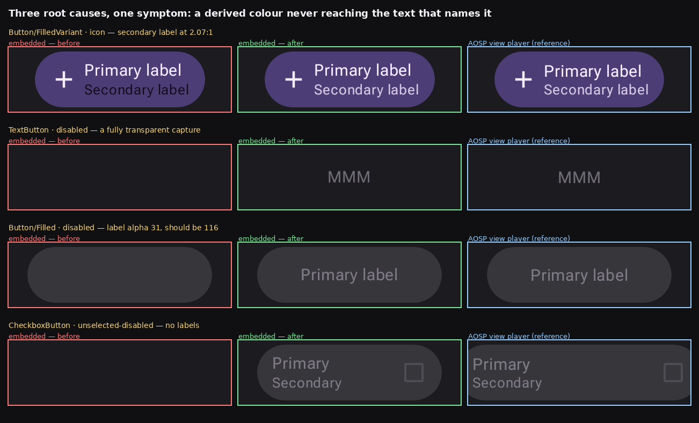
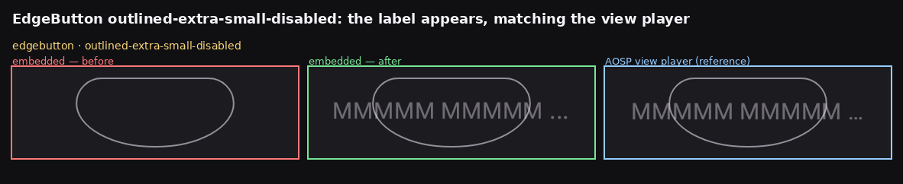

# A derived colour reaching the text that names it

Before/after for the deltas in [#47](https://github.com/yschimke/rc-players/issues/47) and
[#50](https://github.com/yschimke/rc-players/issues/50), which close two of the three symptoms
reported in [#46](https://github.com/yschimke/rc-players/issues/46) — every one of them a colour the
document *derives* failing to reach the text that names it, by three different routes.

Both lanes are rendered locally by `RcEmbeddedRenderHarness` from the same staged documents with the
same font cache, so the only variable is the player. The reference column is
`RcViewPlayerRenderHarness` over the same documents.

| Document | before | after | View player |
| --- | --- | --- | --- |
| `button-filledvariant__ideal__icon` secondary label | `(15, 12, 23)` — **2.07:1** | `(212, 202, 227)` — **5.95:1** | `(212, 202, 227)` — 5.95:1 |
| `textbutton__ideal__disabled` | 0 ink px | 876 ink px, max alpha 97 | 915 ink px, max alpha 97 |
| `button-filled__ideal__disabled` | container only, max alpha **31** | label drawn, max alpha **116** | max alpha 116 |
| `checkboxbutton__ideal__unselected-disabled` | 0 ink px | labels drawn, max alpha 116 | max alpha 116 |

The three routes, in the order they were found:

1. **`updateColor` was never overridden** on `SnapshotRemoteComposeState`, so a computed colour was
   written to the base store while the snapshot mirror kept serving its first cached read.
2. **`CoreText` drew the value it resolved once** — `mColorValue`, a snapshot taken before the
   channels the colour derives from existed.
3. **The computed-op index never walked a component's canvas stream.** Draw-content operations hang
   off a component as a *field*, not as a child, so a walk following `Container.getList()` alone
   misses them — and `remote-m3` builds a disabled label's colour in the *layout* tree from
   `ColorAttribute`s declared in that canvas stream. Its channels resolved against a store nothing
   had written, giving `rgb(alpha, 0, 0, 0)`: a fully transparent label on a control that drew its
   container and its box and no text at all.

The third is the one that closes
[wear-m3-catalog#91](https://github.com/yschimke/wear-m3-catalog/issues/91) — the disabled
`RemoteButton` whose label alpha was 31 where the View player draws 116 — and the checkbox labels
with it.

`edgebutton__ideal__outlined-extra-small-disabled` is the one document of 475 whose pixelmatch score
against the View lane went *up*. It is not a regression: it went from drawing a bare outline to
drawing its label, which the View player draws too — the score rises because the label's glyph
positions differ from the View lane's font, and a label that is absent contributes no differing
pixels at all. Worth keeping in view whenever a score is used as the gate.

## Whole-catalog effect

All 475 published `remote-m3` documents, before and after, same harness and same font cache:

| | documents |
| --- | ---: |
| unchanged | 394 |
| changed, closer to the View player | 61 |
| changed, further from it | 6 |

All six are the EdgeButton/CheckboxButton pattern above: a label that was absent is now drawn, and a
label that is absent contributes no differing pixels at all, so drawing it *raises* the score
against a lane whose glyphs sit a pixel or two elsewhere. Worth remembering wherever a pixelmatch
score is used as a gate.
