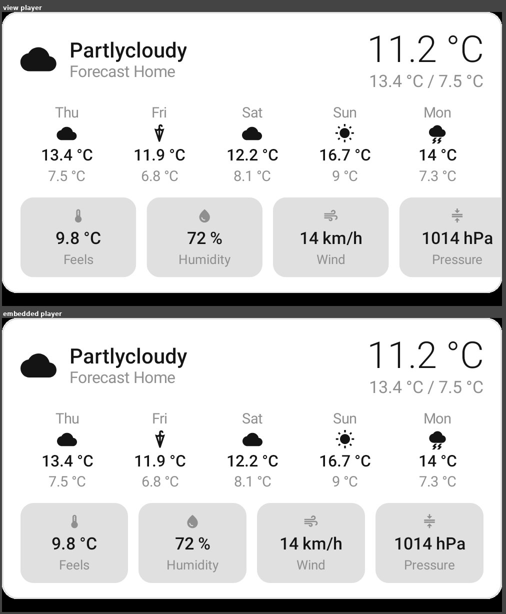
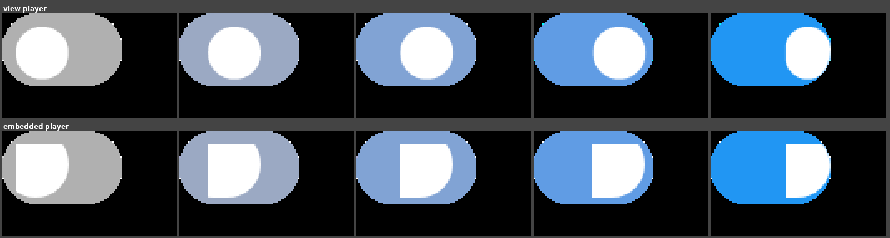
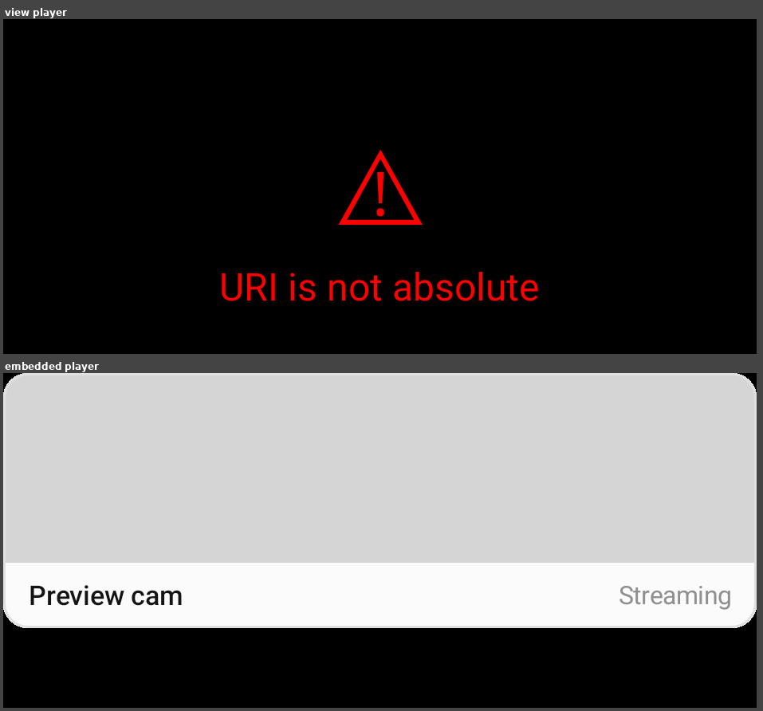

# Embedded vs view player A/B — issue #3936 step 2

Re-run after each embedded-player fix: all 164 `.rc` documents in the
`homeassistant-remotecompose` catalog, both lanes, same commit, same Robolectric harness
(`RcEmbeddedRenderHarness` and `RcViewPlayerRenderHarness`), so the document is a controlled
variable and every difference is the interpreter.

Scored with pixelmatch at `threshold: 0.1` and its default anti-aliasing detection — the same
library and settings `rc-compare.mjs` already uses, rather than a fresh ad-hoc metric.

| result | after #3977 | after #3995, #4000 and the clip fix |
| --- | --- | --- |
| no differing pixels | 16 | **34** |
| differing, under 1% of pixels | 86 | 87 |
| differing, 1–5% | 59 | **40** |
| differing, over 5% | 1 | 3 |
| unrendered on the embedded lane | 2 | **0** |

The "over 5%" column grew because the two `PictureEntity_AppMode` documents now *render* on the
embedded lane instead of throwing, and they score as almost completely different from the view
lane — which loses the whole card to an error panel. That is the embedded player being right and
the score being measured against the wrong reference; see below.

## What the differences actually are

**Text rasterization dominates and is not a defect.** The largest single result,
`WeatherForecast_Light` at 5.57%, is visually indistinguishable — Compose's Skia text stack and the
Android canvas hint and fill glyphs differently. `weather-forecast-text.png` is that document at
5.57%; the two panels read identically.



An exact-inequality pixel count cannot separate this from a real defect, and an erosion filter
cannot either, because glyph strokes are several pixels wide and high contrast. That is why the
numbers above use pixelmatch's AA detection.

**Two real defects came out of the sweep**, both since fixed:

### Switch thumb rendered square — fixed



Both rows are now identical. The cause was not the radius — that was a red herring I filed the
issue on, and instrumenting it is what disproved it. `Modifier.roundedClipRect` prepended the clip
to the *whole* accumulated chain, which put it ahead of `PaddingModifierOperation` as well as the
draw. On a thumb built as `padding(35.4dp, 7.9dp).size(16.dp)` + clip + background, the clip wrapped
the padded 51×24dp box while the background painted the 16×16dp content well inside it, so the
rounded shape never touched what it was meant to round. The track beside it carries no padding,
which is exactly why it looked correct and the thumb did not.

The radius *was* also resolving wrong — `0.5` instead of `22.0`, because `GraphContext` could not
see `ComponentValue`s — and #3995 fixed that. It changed no pixels: `roundedRectRadiusScale` clamps
both values to about the same thing on the box in question.

### An unresolvable image aborted the whole document — fixed by #4000



`PictureEntity_AppMode` (light and dark) threw `IllegalArgumentException: URI is not absolute` out
of `AndroidBitmapLoader.loadBitmap`, reached from `BitmapData.apply` during
`CoreDocument.initializeContext`, and rendered nothing at all.

Neither player can load the image — it is referenced by a relative URI and AndroidX's loader calls
`URI.toURL()` on it. What differs now is the cost: the embedded player draws the rest of the card
(its title and state) with an empty image slot, while the view player replaces the entire card with
a black error panel. **This is the one document where a large pixel difference means the embedded
lane is more correct, not less** — a caution about reading the table above as a parity score.

## Regenerating

The committed sweep is pinned to `homeassistant-remotecompose` source
`72c6d941f244d3d712c6029ba54d6de3147adc12`, published as design-artifact commit
`7d22352e435c405b5ff1c25a19bd4106fa7a3231`. Stage those exact 164 documents first:

```bash
artifact=7d22352e435c405b5ff1c25a19bd4106fa7a3231
curl -fL "https://raw.githubusercontent.com/yschimke/homeassistant-remotecompose/$artifact/bundle/bundle.png" \
  -o /tmp/homeassistant-remotecompose-7d22352e.bundle.png
npm --prefix scripts/design-artifacts ci
node scripts/design-artifacts/rc-compare.mjs \
  --bundle /tmp/homeassistant-remotecompose-7d22352e.bundle.png \
  --player cli/src/main/resources/rc-player/bundle.js \
  --out /tmp/rc-lane-ab-stage \
  --stage-embedded /tmp/rc-lane-ab-input
```

Then render, score, and compose the evidence:

```bash
scripts/rc-lane-ab/render-ab.sh /tmp/rc-lane-ab-input [lane-output-dir]
```

That is the whole recipe — it renders both lanes, prints the table above, and rewrites every image
in this directory. Don't drive the harnesses by hand: the raw Gradle command produces neither the
scores nor these composites, and it has three ways to look like it worked while writing nothing.
`rc.embedded.input` must be **absolute** (the harness resolves it against the *test* working
directory, and a path it cannot resolve fails an `assumeTrue`, which reports as a skipped test in a
green build); `--rerun` is required because the input arrives as a system property rather than a
declared task input, so a second run is `UP-TO-DATE` and keeps the previous PNGs; and `--tests` is
required because `rc.embedded.input` reaches every test in the module. The script's header explains
each one, and it checks the render counts afterwards so a lane that quietly produced nothing fails
loudly instead of recomposing stale evidence. Same trap, and the same treatment, as
`scripts/rc-text-metrics/render-strips.sh`.

Scoring is `scripts/design-artifacts/rc-lane-ab-score.mjs` (pixelmatch, from the package that
already declares it); composition is `scripts/rc-lane-ab/compose_ab.py` (Pillow), which carries the
list of committed images and the document ids behind each one.
