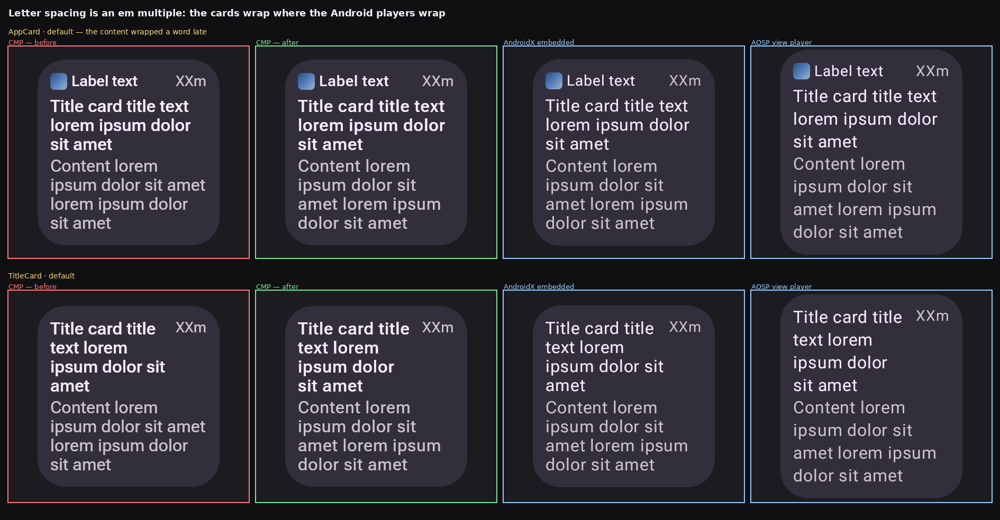

# Letter spacing is an em multiple, not a pixel length

Text style property 12 carries what `android.graphics.Paint.setLetterSpacing` takes — a multiple of
the font size. The vendored AndroidX player spells the same value `data.letterSpacing.em`. The CMP
player read it as a pixel length, which collapsed it to nothing: the published `remote-m3` body
style asks for `0.02857` em, and `0.02857.toSp()` at density 2 is `0.014` sp.

The cost was not a slightly tight line. Text measured about 5% narrow, which is invisible on one
line and **re-breaks every paragraph that wraps**. `AppCard` and `TitleCard` fitted `ipsum dolor sit
amet` on a line where both Android players broke after `sit`, and the cards then came out shorter —
which reads as a layout divergence rather than a text one, and was the largest single class of
CMP-vs-AndroidX difference in the catalog.

## Measured

One text run, `Remote Compose` at 40px, ink width against spacing:

| spacing | ink width | growth |
| ---: | ---: | ---: |
| 0 | 349 px | — |
| 0.02857 em (the `remote-m3` body style) | 364 px | **+15 px** |
| 0.05 em | 375 px | +26 px |
| 0.1 em | 401 px | +52 px |
| 0.5 em | 609 px | +260 px |

Under a pixel reading every one of those rows is 349. The +15 px at the catalog's own spacing is
exactly the width this player was measuring short against the View and embedded lanes on the same
document and the same face.

`RcLetterSpacingRenderTest` pins it as the *growth* between two spacings rather than an absolute
width, so it says nothing about which face the host resolved and cannot drift with it.

## Whole-catalog effect

All 475 published `remote-m3` documents, CMP lane before and after, scored against the AndroidX
embedded lane with the same fonts:

| | documents |
| --- | ---: |
| unchanged | 262 |
| changed, closer to the embedded lane | 85 |
| changed, further from it | 46 |

The 85 are the cards and the text specimens — `appcard__ideal__default` goes 11.0% → 7.3%,
`titlecard__ideal__default` 9.8% → 6.7%.

The 46 are all `edgebutton` cells, moving by about one point. Their text is drawn on an arc and the
glyphs move toward the reference; what dominates their score is a **pre-existing** container-shape
difference between the CMP and Android lanes, and widening the text simply puts more glyph pixels
over the region where the two containers already disagreed. That container difference is untouched
here and is worth its own look.
