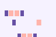

# Bitmap-font operation conformance

These are the same `bitmap-font.rc` bytes, generated exclusively through AndroidX alpha18 writer
APIs, rendered at 96×64 and density 1 by the available reference lanes. Glyph resources are
deterministic inline PNGs, so this comparison does not depend on each lane's RAW8888 channel
interpretation.

| AndroidX View | Upstream AndroidX embedded | Vendored embedded Android |
| --- | --- | --- |
|  |  |  |

| Upstream snapshot | Vendored embedded JVM | CMP JVM |
| --- | --- | --- |
|  |  |  |

Upstream release, upstream snapshot, vendored Android, vendored JVM, and CMP are pixel-identical.
View differs by 0.08%: it filters 24 purple and 24 coral edge pixels rather than drawing those
pixels at their solid source colors. Every lane preserves both intended glyph colors. The dominant
histogram entries are:

| Lane group | Background `#f6f2ff` | Coral `#ffb4ab` | Purple `#6750a4` |
| --- | ---: | ---: | ---: |
| Embedded/CMP | 5,546 | 326 | 252 |
| View | 5,522 | 314 | 240 |

The View's remaining 48 pixels are filtered coral/purple edge colors. This isolates a small bitmap
placement/filtering difference instead of the prior RAW8888 decoding difference, where Android
lost the source colors entirely.

Regenerate the input and all player lanes from the repository root:

```shell
./gradlew :rc-player-compat-tests:generateOperationConformanceFixtures
scripts/rc-operation-conformance/render-lanes.sh --upstream both \
  rc-player/compat-tests/build/fixtures/operation-conformance \
  build/operation-conformance-lanes
```
