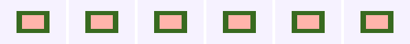
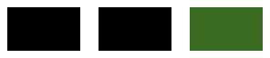

# Graphics-resource operation conformance

Both fixtures use bytes emitted by AndroidX alpha18 writer APIs. They are rendered at 96×64 and
density 1 from the same `.rc` files in every lane.

## Offscreen drawing

`graphics-offscreen.rc` declares a transparent 48×32 bitmap, redirects drawing with
`DrawToBitmap`, paints a green surface and coral inset, restores bitmap id zero, and draws the
result onto the main canvas.



Left to right: AndroidX View, upstream embedded alpha18, upstream embedded snapshot, vendored
embedded Android, vendored embedded JVM, and CMP JVM. All six outputs are pixel-identical. The
individual source PNGs are committed beside the composite.

## Runtime shader

`graphics-runtime-shader.rc` declares a `ShaderData` resource with a four-float `tint` uniform and
uses that shader to fill the inset rectangle.



Left to right: AndroidX View, vendored embedded JVM, and CMP JVM. View and vendored JVM produce the
same black rectangle. CMP resolves the requested uniform and produces `#3b6b21`; it differs from
those references over 62.50% of the canvas. This is recorded as a behavioral difference, not as an
assumption that either renderer is the sole oracle.

The upstream-release, upstream-snapshot, and vendored Android embedded lanes do not have valid PNG
results for this fixture. Their shared Robolectric capture uses `Canvas(Bitmap)`, and Android
runtime shaders require a hardware-accelerated canvas. Each lane therefore records the generated
error `Harness limitation: RuntimeShader requires a hardware-accelerated Android canvas`; the
three `.error` files are committed here. Blank bitmaps from the failed draw are deliberately not
used as evidence. The harnesses still attempt each render and classify only that matching deferred
draw failure, so the metadata cannot mask a future successful capture or an unrelated failure.

Regenerate the inputs and lane results from the repository root:

```shell
./gradlew :rc-player-compat-tests:generateOperationConformanceFixtures
scripts/rc-operation-conformance/render-lanes.sh --upstream both \
  rc-player/compat-tests/build/fixtures/operation-conformance \
  build/operation-conformance-lanes
```

After copying the named source PNGs from their lane directories, regenerate the composites:

```shell
node scripts/design-artifacts/rc-compose-lanes.mjs \
  renders/rc-operation-conformance/graphics-resources/offscreen-composite.png \
  renders/rc-operation-conformance/graphics-resources/offscreen-{view,upstream-release,upstream-snapshot,vendored-android,vendored-jvm,cmp-jvm}.png
node scripts/design-artifacts/rc-compose-lanes.mjs \
  renders/rc-operation-conformance/graphics-resources/shader-composite.png \
  renders/rc-operation-conformance/graphics-resources/shader-{view,vendored-jvm,cmp-jvm}.png
```
