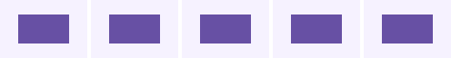

# Particle operation conformance

`particle-loop.rc` is authored with AndroidX alpha18's `ParticlesCreate`, `ParticlesLoop`, and
`ParticlesCompare` writers. It creates one deterministic four-variable particle, publishes those
variables inside the loop, draws the resulting purple rectangle over a lavender background, and
then executes a false comparison branch without changing the pixels. Every lane receives the same
bytes at 96×64 and density 1.



Left to right: AndroidX View, upstream embedded alpha18, upstream embedded snapshot, vendored
embedded Android, and CMP JVM. All five are pixel-identical. (The vendored player's JVM cut, which
painted only the background here, was removed on 2026-09-25; its column was dropped from the
composite.)

Regenerate the inputs and lanes with the commands in the neighboring
[`graphics-resources`](../graphics-resources/README.md) directory. After copying the five
`particle-loop.png` lane results to the source names beside this README, regenerate the composite:

```shell
node scripts/design-artifacts/rc-compose-lanes.mjs \
  renders/rc-operation-conformance/particles/composite.png \
  renders/rc-operation-conformance/particles/{view,upstream-release,upstream-snapshot,vendored-android,cmp-jvm}.png
```
