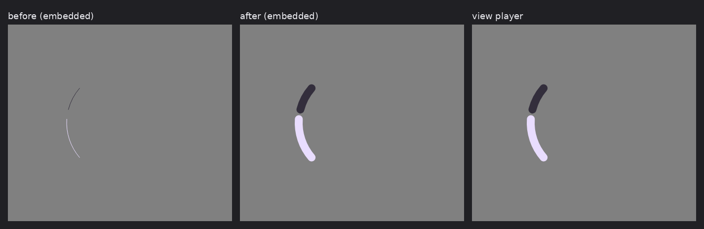

# A paint float that is a variable reference, not a number

Before/after for the delta in [#52](https://github.com/yschimke/rc-players/issues/52), which closes
the last of the three symptoms reported in
[#46](https://github.com/yschimke/rc-players/issues/46) —
[wear-m3-catalog#289](https://github.com/yschimke/wear-m3-catalog/issues/289), an arc that drew a
hairline whatever `strokeWidth` it was given.

Both lanes are rendered locally by `RcEmbeddedRenderHarness` from the same staged documents, so the
only variable is the player. The reference column is `RcViewPlayerRenderHarness` over the same
bytes.

| Document | before | after |
| --- | --- | --- |
| `arcprogress` (`strokeWidth` is a NaN-boxed id) | **1.15%** of pixels differ from the view lane — 2095px | **0 differing pixels** |
| `circularprogress` (`strokeWidth` is a literal) | 0 differing pixels | 0 differing pixels |

## Why it drew a hairline rather than a wrong width

Four paint-bundle commands encode their float as a literal **or** as a NaN-boxed id into the float
store, and the reference player names the four together in both `PaintBundle.registerListening` and
`PaintBundle.resolveIds` (`third_party/remote-compose-player/src/core/operations/paint/`):
`TEXT_SIZE`, `STROKE_WIDTH`, `ALPHA` and `STROKE_MITER`.

`RcPlayerPaint.kt` already had the resolver for this — `resolvePaintFloat` — but used it only for
the gradient shaders' coordinates. The three applied scalar commands read the word with
`Float.fromBits` alone. That does not yield a wrong number; it yields **NaN**, and NaN then loses
every comparison downstream in silence. `Stroke(width = NaN)` reaches the canvas and the platform
rasterises its minimum.

`STROKE_MITER` is consumed without being applied at all, so it has nothing to resolve yet and is
left as it was.

## Why the pair of fixtures

The failure and the fix are on **different branches of the same word**. `arcprogress` boxes an id
and is the regression. `circularprogress` writes a literal and is the guard: a "fix" that resolved
unconditionally — treating every word as an id — would take it to zero ink, and nothing else in the
suite draws a stroked arc from a constant. Both are asserted in
`RcPaintFloatIdRenderTest`, on pixels, because NaN is invisible at every level above the raster:
the bundle decodes, the op applies, the draw runs, and only the ink is wrong.
