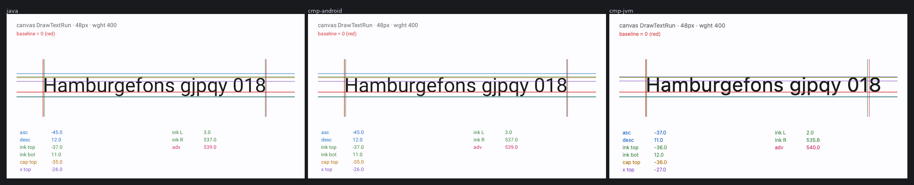
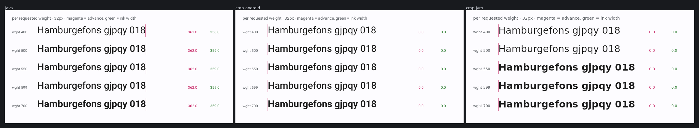
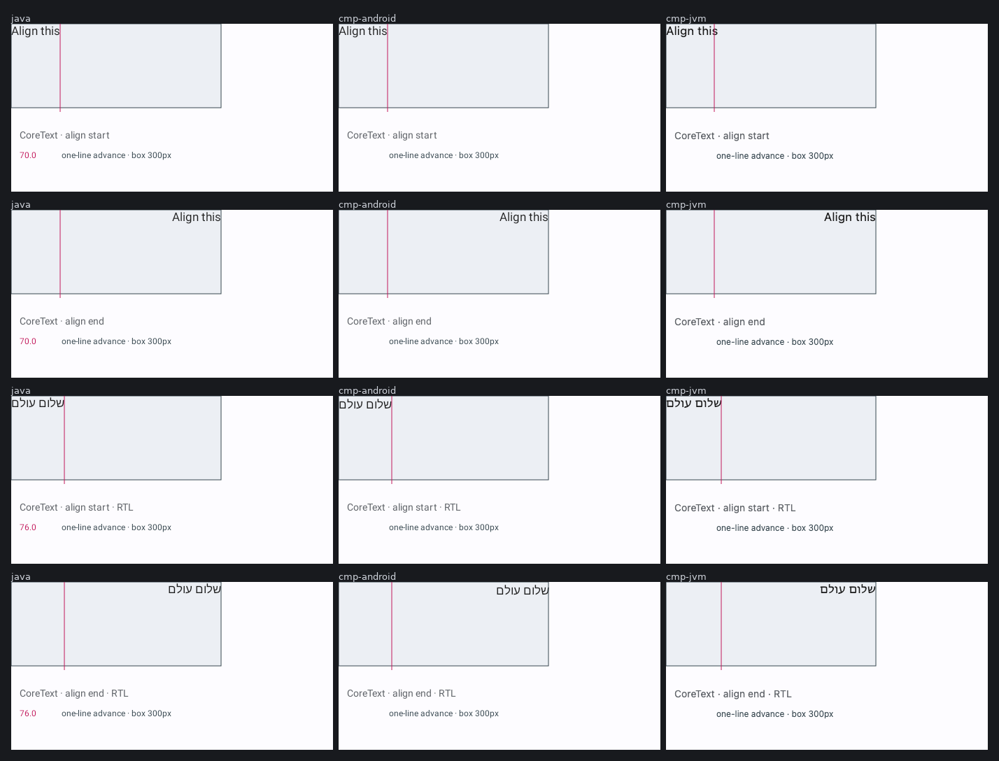
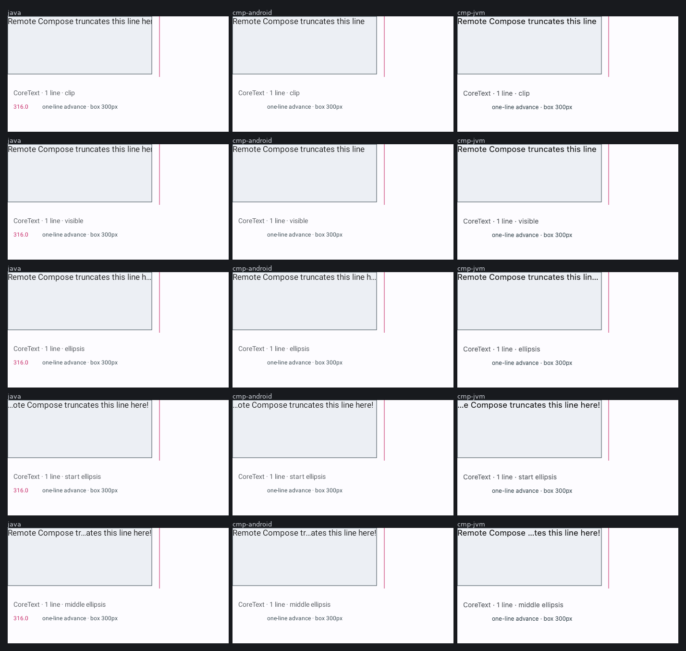
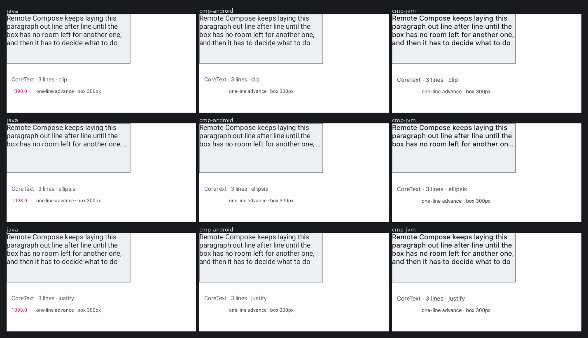
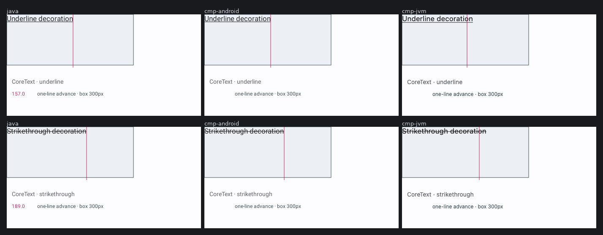
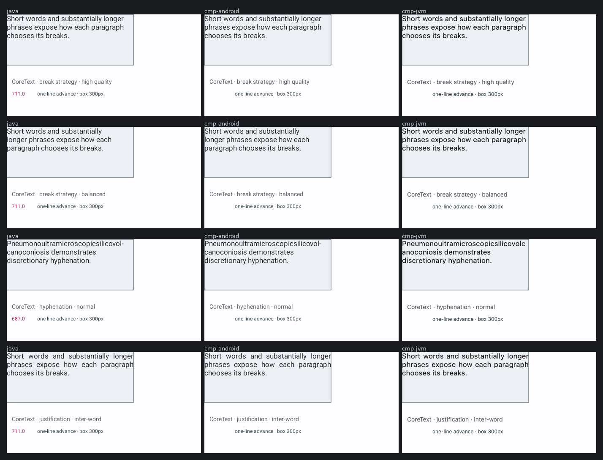
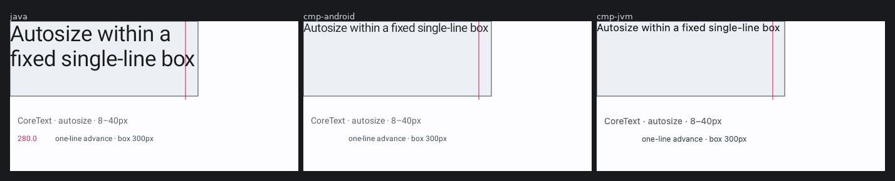

# Text-metric guide lines across three player lanes — issue #3595

Remote Compose documents that measure their own text with `TextMeasure` and draw the answer as guide
lines, so each lane renders *its own* metrics. Design notes:
[`docs/design/RC_TEXT_METRICS.md`](../../docs/design/RC_TEXT_METRICS.md).

Blue is the **font** box (typographic ascent/descent), green is the **ink** box, magenta is the
**advance**, red is the baseline. Each value is printed by the player itself via `TextFromFloat`, so
the image carries the numbers without a sidecar.

## The metric card



The refreshed strip above comes from a 2026-08-11 run that generated 31/31 images on every
server-side lane with no `.error` files. Its card values are:

| metric | `java` | `cmp-android` | `cmp-jvm` |
| --- | ---: | ---: | ---: |
| font top / bottom | -45.0 / 12.0 | -45.0 / 12.0 | -37.0 / 11.0 |
| ink top / bottom | -37.0 / 11.0 | -37.0 / 11.0 | -36.0 / 12.0 |
| ink left / right | 3.0 / 537.0 | 3.0 / 537.0 | 2.0 / 535.6 |
| advance | 539.0 | 539.0 | 540.0 |

The Android embedded lane now matches AndroidX Java exactly. The JVM lane executes the same
selector/flag behavior and exposes its own Skiko metrics rather than zeroes.

## The weight sweep



Each row reports **two** numbers: the advance (magenta) and the ink width (green), measured off
different code paths. On `java`: 361.0 / 358.0 at wght 400, then 362.0 / 359.0 at 500, 550, 599 and
700 alike — while 700 is plainly heavier than 500 in the same image.

Equal advances alone would prove nothing; families are routinely drawn duplexed, keeping advances
fixed across weights on purpose, which is why each row carries a second number off a different code
path. Both flat while the glyphs visibly differ means 550 and 599 are **metrically
indistinguishable** from 500 here — nothing downstream of layout can tell them apart.

It does *not* establish that the weight was synthesised rather than resolved: `getTextBounds` reports
the outer rectangle, so a real bold that thickens its stems inward, preserving the advance and the
extrema, gives the same signature. Telling those apart needs the resolved face, which this harness
cannot yet report. The ink box is integer-quantised too, so read it as corroboration rather than as a
precise instrument.

## Start and end alignment, in both directions



`ALIGN_START` and `ALIGN_END` are the only alignments whose meaning depends on direction, and on
English text they land exactly where `ALIGN_LEFT` and `ALIGN_RIGHT` do — so an LTR-only matrix cannot
tell a correct lane from one that hard-coded start→left. Against a Hebrew paragraph, all three lanes
keep start at the left edge and end at the right.

That makes the question askable, not answered. `CoreText` carries **no layout direction** — AOSP
derives its only flags word from `textAlign >>> 16` — so a document cannot state that its container
is RTL, and all three harnesses run their default LTR one. Resolving `START` against an LTR container
and resolving it to `LEFT` outright look identical here. Separating them needs a harness running a
lane under an RTL layout direction.

## The layout-tree modes





The dark rectangle is the box the text was handed; the magenta rule is where the *player's* own
measurement says a single unwrapped line of the same string ends. On the single-line fixture the
advance (316px) lands just outside the 300px box, which is why it ellipsised; on the wrapping fixture
the one-line advance is 1098px and runs off the frame.

The script also compares only the 298x118 interior of each box against `java`; the frame, title and
numeric guide labels do not count. Before the parity mapping, `cmp-android` differed on **2.280%**
of single-line pixels and **8.730%** of paragraph pixels. The selected behavior reduces those to
**0.154%** and **0.000%** respectively. End/start/middle ellipsis and every paragraph mode are
pixel-identical on Android. Clip/visible retain a tiny right-edge partial-glyph difference.

The JVM column also shows a real remaining limit: its current Compose Desktop/Skiko backend paints
start and middle ellipsis as end ellipsis. That is tracked in
[#3662](https://github.com/yschimke/compose-ai-tools/issues/3662), rather than hidden by the aggregate
score.

The pictures also pin two non-obvious Java behaviors: multi-line clip continues beyond
`maxLines = 3` while ellipsis stops at three, and the alignment value named `JUSTIFY` maps to normal
alignment unless separate justification property 17 is enabled. Matching those observations—not
Compose's similarly named defaults—is what produced the lower residual.

## Extended CoreText properties







These focused rows make properties 15–19, 22, 25 and 26 independently visible. High-quality and
balanced breaking differ in the Java reference and `cmp-android` follows those breaks; property 17
stretches inter-word spaces without reinterpreting alignment value `JUSTIFY`. Underline and
strikethrough match on all three server-side lanes.

Autosize exposes another Java exception: a one-line clip request is measured as a wrapped block and
the largest 0.5px step whose height fits is selected. It may therefore paint multiple lines despite
`maxLines = 1`. Compose's platform autosizer respects the line cap and fits a single line instead;
the strip records that backend difference rather than hiding it behind a manual layout algorithm.

## Regenerating

```bash
scripts/rc-text-metrics/render-strips.sh
```

That builds the fixtures, renders all three lanes, and rewrites the ten `*-three-lanes.png` files
in this directory — the images above, not just the per-fixture PNGs. It is one script rather than a
block of commands to copy because the underlying invocation has **three** ways to look like it
worked while producing nothing or something stale, and the strips are what the design doc argues
from:

- `rc.embedded.input` must be an **absolute** path. The harness resolves it against the *test*
  working directory, not the repo root, and an unresolvable path fails an `assumeTrue` — which
  Gradle reports as a skipped test inside a green build. A relative path prints `BUILD SUCCESSFUL`
  and writes no PNGs whatsoever.
- `--rerun` (a *task* option, so it follows the task name) is needed because the fixture directory
  arrives as a system property, not as a declared task input. Without it a second run is
  `UP-TO-DATE` and quietly leaves the previous run's PNGs in place.
- `--tests` is needed because `rc.embedded.input` reaches **every** test in the module, not just the
  render harnesses. Unfiltered, `RcSemanticsExtractionTest` and `RcFigmaSvgExportTest` pick the
  first staged document up as if it were a catalog capture and fail against it — after the PNGs have
  already been written, so the regeneration looks broken when it isn't.

The script fails loudly if a lane rendered fewer than the full fixture set — not merely if it
rendered none — because a missing or partial lane would otherwise compose into a narrower strip, or
one built from a previous run's leftovers, that still looks like a picture of three lanes. It clears
the lane directories first for the same reason.

It needs **Pillow** and the **DejaVu Sans** font (`pip install Pillow`, `apt-get install
fonts-dejavu-core`). `RC_TEXT_METRICS_LABEL_FONT` can point at the same DejaVu Sans file in a
non-system location. Both are checked before the renders start rather than after them, and the font
is pinned with no fallback on purpose: labelling the strips with whatever face a host happens to
have would rewrite all seven committed PNGs and read as a rendering change when only the caption
moved.

Pass a directory to keep the per-lane PNGs somewhere predictable
(`scripts/rc-text-metrics/render-strips.sh /tmp/rc-metrics`); otherwise they go to a temporary
directory whose path is printed at the end. Which fixtures become strips is
[`compose_strips.py`](../../scripts/rc-text-metrics/compose_strips.py)'s `STRIPS` table — all 31
fixtures render, and only the ten cited here are composed.
