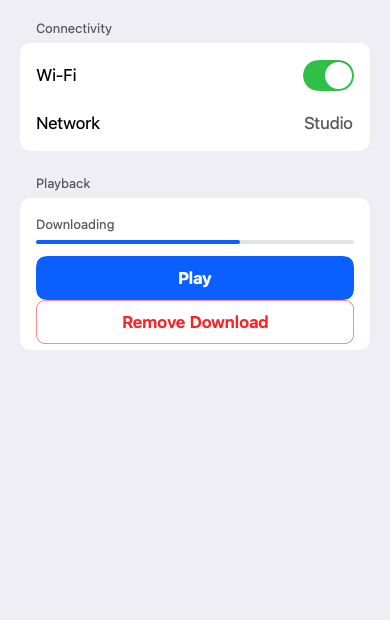
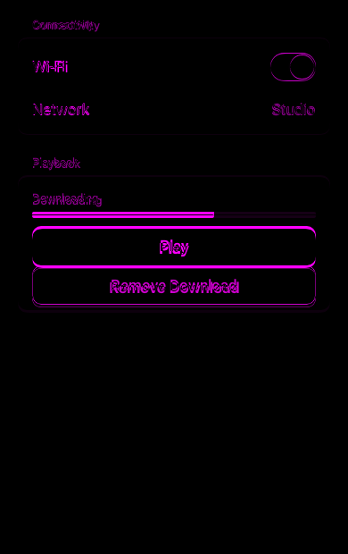

# Remote Apple component prototype

The Remote Compose images are rendered at 390 × 620 with the repository's vendored embedded
Compose player. The first comparison isolates what the component vocabulary adds over an equivalent
list of raw text primitives.

| Before — raw creation primitives | After — Apple-styled component set |
| --- | --- |
|  |  |

## SwiftUI reference comparison

The left image is rendered from the real SwiftUI implementation in
`swiftui/RemoteAppleComparisonApp.swift` on a GitHub macOS runner. The right image is the same
specification captured through `remote-creation-compose` and rendered by the CMP player.

| SwiftUI reference | Remote Compose candidate | Pixel diff |
| --- | --- | --- |
|  |  |  |

[`comparison.json`](comparison.json) records a **3.92% changed-pixel ratio** at a 16/255 threshold
and **3.96/255 mean absolute channel error**. The diff is concentrated in text rasterization and
weight, with small edge differences around rounded controls; the large layout geometry agrees.

Regenerate the documents and rasterize them with:

```bash
scripts/agent-gradle.sh \
  :prototype-remote-apple-components:testDebugUnitTest \
  -Premote.apple.fixtureDir=/tmp/remote-apple-input

# Add a manifest containing raw-primitives and gallery at 390 × 620, density 1, then:
scripts/agent-gradle.sh \
  :third-party-rc-embedded-player:testDebugUnitTest \
  --tests ee.schimke.composeai.rcembedded.RcEmbeddedRenderHarness \
  -Prc.embedded.input=/tmp/remote-apple-input \
  -Prc.embedded.output=/tmp/remote-apple-output

# On macOS, build the side-by-side app and render the SwiftUI reference:
scripts/build-remote-apple-comparison.sh
executable="build/remote-apple-comparison/Remote Apple Comparison.app/Contents/MacOS/RemoteAppleComparison"
"$executable" --render-reference /tmp/swiftui-reference.png
```
