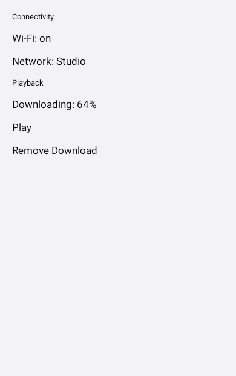
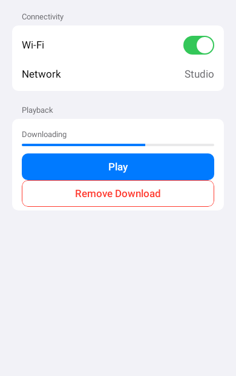

# Remote Apple component prototype

Rendered at 390 × 620 with the repository's vendored embedded Compose player. Both documents are
captured through `remote-creation-compose`; the comparison isolates what the component vocabulary
adds over an equivalent list of raw text primitives.

| Before — raw creation primitives | After — Apple-styled component set |
| --- | --- |
|  |  |

Regenerate the documents and rasterize them with:

```bash
scripts/agent-gradle.sh \
  :prototype-remote-apple-components:testDebugUnitTest \
  -Premote.apple.fixtureDir=/tmp/remote-apple-input

# Add a manifest containing raw-primitives and gallery at 390 × 620, density 1, then:
scripts/agent-gradle.sh \
  :third-party-rc-embedded-player:testDebugUnitTest \
  --tests ee.schimke.composeai.rcembedded.RcEmbeddedRenderHarness \
  -Prc.embedded.input=/tmp/remote-apple-input \
  -Prc.embedded.output=/tmp/remote-apple-output
```

The evidence is intentionally about the authoring layer. It does not claim exact pixel parity with
SwiftUI yet; that needs Apple-hosted reference captures and should be the next experiment.
