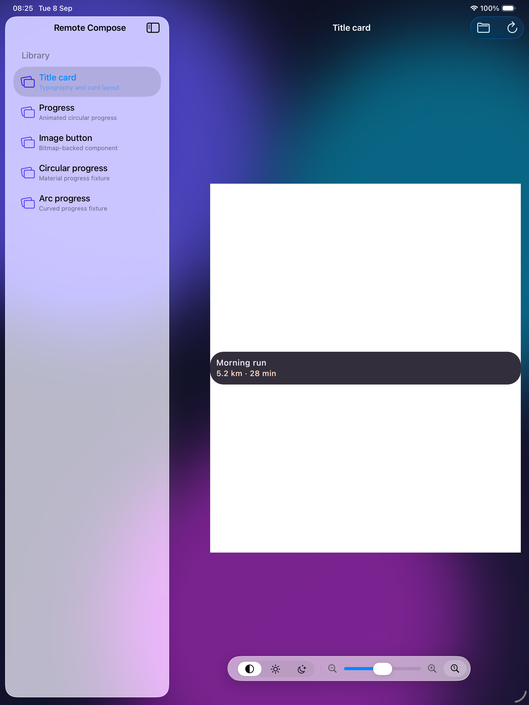
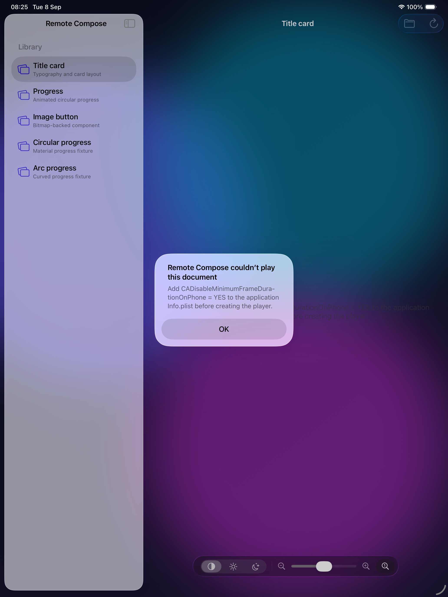
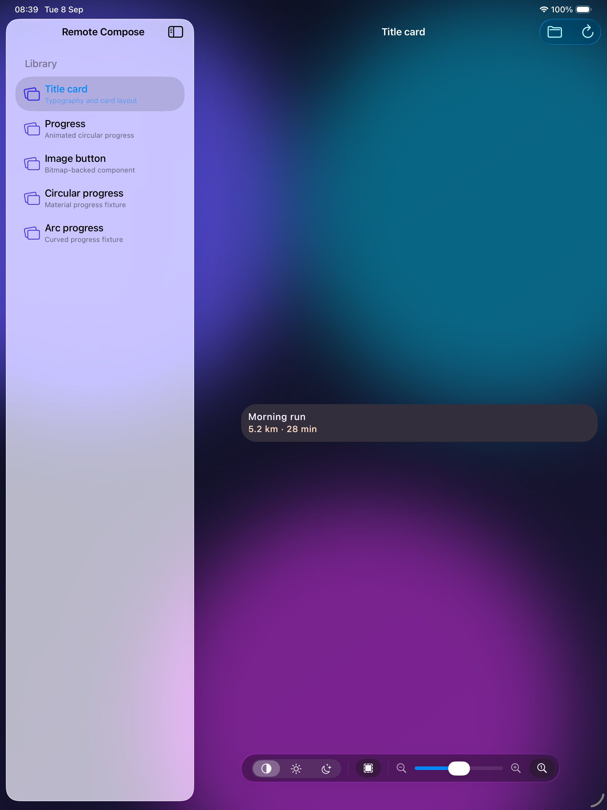

# Remote Compose for Apple

A SwiftUI host for `RcComposePlayer`. It links the release XCFramework assembled from the current
checkout and compiles the checked-in `RcComposePlayerSwiftUI` source overlay. The app and its
downloadable zip therefore test the exact binary and adopter API that will ship together. SwiftPM
consumers still receive the same framework through the checksummed binary target in `Package.swift`.

The framework ships native iOS, iOS Simulator, and macOS arm64 slices. This sample intentionally
hosts the UIKit API, so it is an iPad app that runs in the iOS Simulator and opts into **Designed
for iPad on Mac** on Apple-silicon Macs. The repository also exposes `RcComposeWindow` for native
AppKit hosts.

## Run it

Open `RemoteComposePlayer.xcodeproj`, select an iPad simulator, and run. Or build it without opening
Xcode:

```bash
./gradlew :rc-player-compose:assembleRcComposePlayerReleaseXCFramework --max-workers=1
./scripts/build-apple-player.sh
```

Each GitHub Release also includes `RemoteComposePlayer-Simulator-arm64.zip`. Boot an iPad in
Simulator, unzip the download, and run its `install-and-run.sh` helper. CI builds that exact archive
on every pull request before the release workflow publishes it.

On an Apple-silicon Mac, Xcode also offers **My Mac (Designed for iPad)** as a destination. The
command-line helper accepts the same destination through `RC_APPLE_PLAYER_DESTINATION`; the default
is the generic arm64 iOS Simulator build used by CI.

The app includes several compatibility fixtures from this repository. Drop or import any `.rc`
document to play it. Xcode 26 applies Liquid Glass to the navigation and toolbar chrome; the custom
playback controls share a `GlassEffectContainer` so their lensing and morphing are rendered as one
material region. The dashed-square control toggles the player surface between opaque and
transparent, allowing the aurora backdrop to show through document areas that do not draw.

The sample itself compiles the source overlay, so its normal render and its preflight error are
capturable adopter-facing states. The second state was built with the required plist key removed;
before the overlay preflight, the same integration error terminated inside `ComposeUIViewController`.

| Overlay render | Typed integration error |
| --- | --- |
|  |  |

With the background toggle enabled, the Compose Metal surface preserves alpha and the app's aurora
shows through pixels the document does not draw:


