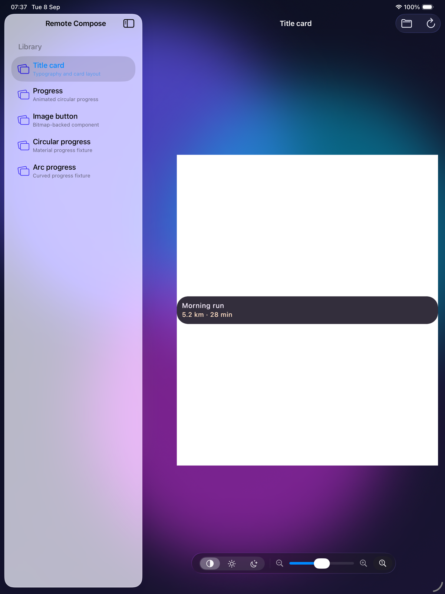

# Remote Compose for Apple

A SwiftUI host for the released `RcComposePlayer` XCFramework. It deliberately consumes the
published Swift package instead of linking the current checkout, so opening and building the sample
tests the same signed, checksummed bytes a downstream Swift application resolves.

The framework ships native iOS, iOS Simulator, and macOS arm64 slices. This sample intentionally
hosts the UIKit API, so it is an iPad app that runs in the iOS Simulator and opts into **Designed
for iPad on Mac** on Apple-silicon Macs. The repository also exposes `RcComposeWindow` for native
AppKit hosts.

## Run it

Open `RemoteComposePlayer.xcodeproj`, select an iPad simulator, and run. Or build it without opening
Xcode:

```bash
./scripts/build-apple-player.sh
```

Each GitHub Release also includes `RemoteComposePlayer-Simulator-arm64.zip`. Boot an iPad in
Simulator, unzip the download, and run its `install-and-run.sh` helper. CI builds that exact archive
on every pull request before the release workflow publishes it.

On an Apple-silicon Mac, Xcode also offers **My Mac (Designed for iPad)** as a destination. The
command-line helper accepts the same destination through `RC_APPLE_PLAYER_DESTINATION`; the default
is the generic arm64 iOS Simulator build used by CI.

The app includes several compatibility fixtures from this repository. Drop or import any `.rc`
document to play it. Xcode 26 applies Liquid Glass to the navigation and toolbar chrome; the custom
playback controls share a `GlassEffectContainer` so their lensing and morphing are rendered as one
material region.


