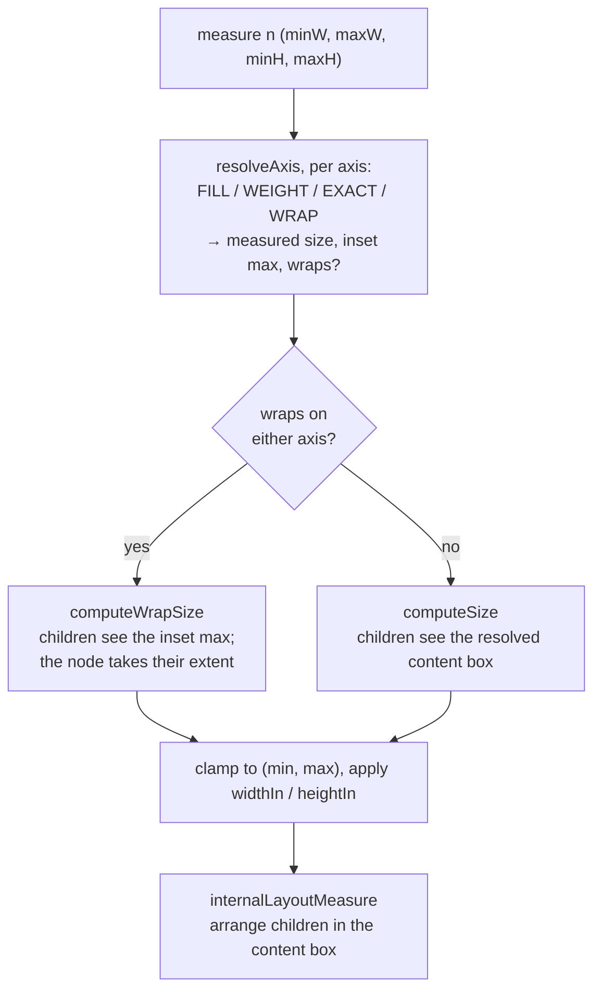

# A formal specification of the RemoteCompose layout algorithm

A machine-checked, executable specification of the RemoteCompose measure and
layout pass, written in [Lean 4](https://lean-lang.org) and validated against
the gold files produced by the Android reference implementation.

It covers six layout managers — **`BoxLayout`**, **`RowLayout`**,
**`ColumnLayout`**, **`CollapsibleRowLayout`**, **`CollapsibleColumnLayout`** and
**`FlowLayout`** — together with the size, padding, weight, `spacedBy` and
`collapsiblePriority` modifiers, under the default measure policy. For the
collapsible and flow managers it specifies not just where each child goes but
**which children survive**: the computed visibility is checked against the gold
files too.

## Why

The conformance suite in the parent directory pins down *what* the Android
engine produces for 174 documents. It does not say *why*. A player being ported
to a new language has to reverse-engineer the algorithm from
`BaseModernMeasurePolicy.measure` and the `computeWrapSize` / `computeSize` /
`internalLayoutMeasure` triple on each manager, and discover the sharp edges the
hard way.

This directory states the algorithm once, precisely:

* **Executable.** `#eval layout myTree 300 200` computes a layout.
* **Checked against the engine.** [`Conformance.lean`](RemoteComposeLayout/Conformance.lean)
  is generated from the existing gold files and replays every in-scope document
  through the specification. All checks pass.
* **Proved.** [`Theorems.lean`](RemoteComposeLayout/Theorems.lean) proves
  invariants a re-implementation can rely on, and pins down the surprising
  behaviours so that "tidying up" the specification breaks the build.

## Layout

| File | Contents |
| --- | --- |
| [`Basic.lean`](RemoteComposeLayout/Basic.lean) | Scalars, geometry, `Dim`/`DimIn`, the modifier chain, alignment enums |
| [`Node.lean`](RemoteComposeLayout/Node.lean) | The input tree `Node` and the output tree `LayoutTree` |
| [`Measure.lean`](RemoteComposeLayout/Measure.lean) | **The algorithm.** `resolveAxis`, `arrange`, and the mutually recursive `measure` |
| [`Conform.lean`](RemoteComposeLayout/Conform.lean) | Traversal and tolerance-based comparison against recorded bounds |
| [`Conformance.lean`](RemoteComposeLayout/Conformance.lean) | *Generated.* One check per gold document per viewport size |
| [`Theorems.lean`](RemoteComposeLayout/Theorems.lean) | Proved properties and worked examples |
| [`tools/gen_conformance.py`](tools/gen_conformance.py) | Regenerates `Conformance.lean` from `../tests/` and `../gold/` |
| [`doc/spec.tex`](doc/spec.tex) | Prose/mathematical rendering of the same specification |

## Prose specification

[`doc/spec.tex`](doc/spec.tex) states the algorithm as a system of mathematical
definitions rather than Lean code, with each rule traced to a line range in the
reference Java and to the Lean definition that implements it. It also carries
the notation correspondence table, the conformance results, and the worked
examples.

Build it with [tectonic](https://tectonic-typesetting.github.io) (`brew install
tectonic`):

```bash
tectonic doc/spec.tex     # writes doc/spec.pdf
```

> [!NOTE]
> The document quotes concrete numbers — 99 documents, 294 checks, and the
> skip breakdown. Re-run `python3 tools/gen_conformance.py --report` and update
> Section 11 if the corpus changes.

## Building

Lean is installed through `elan`, which pins the toolchain from `lean-toolchain`:

```bash
curl -fsSL https://raw.githubusercontent.com/leanprover/elan/master/elan-init.sh | sh -s -- -y
export PATH="$HOME/.elan/bin:$PATH"
```

Then, from this directory:

```bash
lake exe cache get     # download prebuilt Mathlib (~5 GB, once)
lake build             # typecheck the spec, run every conformance check
```

A clean `lake build` that reports no errors *is* the test suite: every
conformance check is a `#guard`, and every theorem is checked by the kernel.

> [!NOTE]
> The invariants and characterisations in `Theorems.lean` are ordinary
> kernel-checked proofs. The conformance `#guard`s and the worked examples
> (which use `native_decide`) are evaluated by the compiler instead, so they
> rest on the Lean compiler being correct — the usual trade-off for checking
> concrete arithmetic at this scale.

To regenerate the conformance file after the gold files change:

```bash
python3 tools/gen_conformance.py --report
```

## The algorithm in one page

`measure` is a single top-down recursion. Per node:



Only steps 2 and 4 are kind-specific: all six managers differ purely in
`computeWrapSize`, `computeSize` and `internalLayoutMeasure`. Everything else is
shared by `BaseModernMeasurePolicy`.

Two of the six layer an extra structural pass inside those hooks. A collapsible
manager measures its children, sorts them by `collapsiblePriority`, and walks
them greedily until one does not fit — after which *every* remaining child is
dropped, however small. A flow segments its children into rows and then runs the
inherited `RowLayout` machinery once per row. Both passes are pure functions of
already-measured children, so neither re-enters the recursion.

The specification models the **default** policy,
`EnforceConstraintsMeasurePolicy` (`LayoutManager.DEFAULT_MEASURE_TYPE`,
version 4), which is `BaseModernMeasurePolicy` with `shouldApplyInsetWrap`,
`shouldUpdateComponentValues` and `shouldEnforceConstraints` all enabled.

### Coordinates

A child's `x` and `y` are relative to its parent's **content origin**: the
parent's padding is *not* folded in. This matches `ComponentMeasure.setX` /
`setY`, and it is the convention the gold files record.
`LayoutTree.absolute` converts to window coordinates.

## Five things worth knowing

These were all discovered while reconciling the specification with the gold
files, and each is now locked down by a theorem or a worked example in
`Theorems.lean`.

> [!IMPORTANT]
> **The modifier chain is order-sensitive, and `padding` behaves differently in
> its two roles.** `LayoutComponent.updatePadding` sums *every* padding modifier
> to inset the children, but `computeModifierDefinedWidth` `break`s at the first
> width modifier, so only padding declared *before* it grows the component.
> `Modifier.padding(8).size(50)` is 66 px wide; `Modifier.size(50).padding(8)` is
> 50 px wide. Both inset their children by 8. This is why the specification
> keeps modifiers as an ordered list rather than a record.

> [!IMPORTANT]
> **`Row` and `Column` are not mirror images.** `ColumnLayout.computeSize`
> resolves vertical weights during the size pass, gated on a
> `DIRECT_WEIGHT_CALCULATION` flag that is hard-coded to `true`;
> `RowLayout.computeSize` is a plain shrinking sweep and defers weights to
> `internalLayoutMeasure`. The *collapsible* column, by contrast, really is a
> verbatim mirror of the collapsible row.

> [!WARNING]
> **`spacedBy` combined with a `SPACE_*` arrangement overflows.**
> `internalLayoutMeasure` derives the `SPACE_*` gaps from the children's widths
> *excluding* `spacedBy`, then still adds `spacedBy` between children. A row
> that uses both overflows its container by `spacedBy * (n - 1)`.
> `Theorems.spacedAndArranged` is a two-child witness that ends 10 px past its
> container.

> [!WARNING]
> **A collapsible manager's fit test is blind to `spacedBy`, and its budget
> includes its own padding.** It admits children while their bare widths fit,
> then adds the spacing anyway — so a spaced collapsible layout keeps one child
> too many and overflows by up to `spacedBy * (n - 1)`. It also decides against
> `m.getW()`, the full measured width, not the content box the children are then
> placed in. `Theorems.spacedCollapsingRow` is a witness.

> [!CAUTION]
> **A child a flow refuses does not stay refused.** `segmentComponents` records
> the refusal with `setVisibility(GONE)`, which writes the *base* visibility
> rather than an override, and nothing clears it. The next pass reads the child
> back as zero-width, decides a zero-width item fits, and lets it rejoin a row at
> whatever position the cursor had reached — potentially outside the container.
> `Theorems.cappedFlow` reproduces this; the gold file `flow_max_lines` is
> tagged `suspicious` for exactly it.

A sixth, which is a property of the *encoder* and the *parser* rather than the
layout engine: `RecordingModifier.setWidthModifier` keeps at most one width
modifier per component and updates it in place, so
`Modifier.width(100).weight(1)` records a single `WEIGHT` modifier and the `100`
is discarded. And a bare JSON `weight` key is **axis-relative** —
`DefaultModifierParsers` consults `parser.isParentVertical()` and routes it to
`verticalWeight` inside a `column` or `collapsibleColumn` and to
`horizontalWeight` everywhere else, `flow` included. `collapsiblePriority`
resolves its orientation the same way.

## Modelling choices

* **Rationals, not floats.** The reference implementation computes in `float`,
  which is opaque to Lean. The specification uses exact `ℚ`, performing the same
  operations in the same order, and the conformance checks allow the suite's
  usual `0.5` px tolerance. This also keeps exact weight splits such as `200/3`
  honest instead of `66.66666666666667`.
* **`Float.MAX_VALUE` is modelled as a finite rational**, `2^128 - 2^104`,
  because the reference implementation genuinely uses that finite value as its
  "unbounded" sentinel rather than an infinity.
* **`EXACT_DP` is modelled by `Dim.exact`**, since it is `EXACT` after the
  density multiplication. The conformance suite runs at density 1.

## Scope

**Modelled:** `BoxLayout`, `RowLayout`, `ColumnLayout`, `CollapsibleRowLayout`,
`CollapsibleColumnLayout`, `FlowLayout`; `EXACT`, `FILL` (with and without a
fraction), `WRAP`, `WEIGHT`; padding; `widthIn` / `heightIn`; all alignments and
arrangements; `spacedBy`; `collapsiblePriority`; `maxColumns` / `maxLines`;
`minIntrinsicWidth` / `minIntrinsicHeight`; computed `GONE` visibility; the
modifier chain.

**Not modelled yet:** scrolling; `StateLayout`; `FitBoxLayout`; text and image
measurement; the explicit `visibility` modifier; `offset`; animation; computed
layouts and inline expressions; `INTRINSIC_MIN` / `INTRINSIC_MAX`;
`FILL_PARENT_MAX_*`; `alignByBaseline`; `wrapContentSize`; non-unit density.

The generator reports exactly which documents each exclusion costs:

```bash
python3 tools/gen_conformance.py --report
```

Each of these is an incremental extension: the shared measure pass is already in
place, and a new manager needs only its `computeWrapSize`, `computeSize` and
`internalLayoutMeasure`.